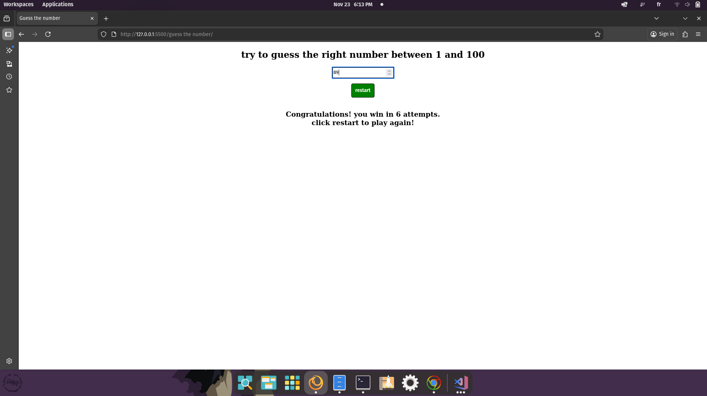

# Guess the Number

Welcome to **Guess the Number** — a simple interactive game where you guess a random number between 1 and 100.

## 🚀 Project Overview
This game generates a random number and prompts the user to guess it. The UI provides feedback (higher or lower) and counts attempts.

## 🌟 Features
- Random number generation (1–100)
- Feedback: 'your number is bigger' or 'your number is smaller'
- Tracks number of attempts and allows restarting the game

## 🛠️ Technologies Used
- Frontend: HTML, CSS, JavaScript

## 📦 Project Structure
```
index.html      # Main page
main.js         # Game logic
style.css       # Styles
```

## 📸 Screenshots


## ✨ How to Use
1. Open `index.html` in your browser.
2. Enter a number and click the 'guess' button to play. The UI tells you whether your guess is higher or lower than the target number.

## 👤 Author
**ISSAM SENSI**

---
© 2025 [issamsensi](https://github.com/issamsensi)
